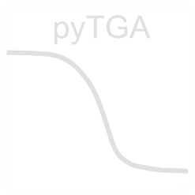

# pyTGA

<p align="center">
  
</p>

## Description
A simple python library for parsing and processing Thermogravimteric analysis (TGA) data. At the moment, .txt files from Perkin Elmer and Metteld Toledo are supported. Work in progress, if you got suggestions or request please submit an issue.

[](https://github.com/MyonicS/pyTGA/actions/workflows/test.yml)

> **⚠️ WARNING**: pyTGA is under active development. Braking changes can occur. Please report any issues using the [Issue Tracker](https://github.com/MyonicS/pyTGA/issues).

## Installation 
- clone the repository:
```
git clone https://github.com/MyonicS/pyTGA
```
- install the package by **navigating to the cloned repository** in your python environment and executing the following command:

```
pip install -r requirements.txt
pip install -e .
```
- You should now be able to load the package in python by using:

```python
import pyTGA as tga
```

## Installation (simplest version)
- Download the repository. 
- Copy the *py_TGA* folder to the folder where the script you wanna use for analysis is located. Example:

```
My_Scripts
│
└───TGA
│   │   myTGA_analysis.py
│   │   myTGA_notebook.ipynb
│   │
│   └───*pyTGA*
```

## Usage
Parse a TGA file using 
```python
tga_exp = tga.parse_TGA('*path-to-your-file*')
```
Make a quick plot to check: 

```python
tga_exp.quickplot()
```
Access individual stages as pandas DataFrame:

```python
tga_exp.stages['stage1']
```

Check the example notebook for more info how to use this package, documentantion to be extended. For parsing differences between Mettler Toledo and Perkin Elmer check the 'parsing' notebook.

## Support
If you find bugs or have other questions send me a message or open an issue.

## Roadmap
- [ ] Support for more manufacturers
- [ ] Muliple notebooks for specific usecases like kinetics
- [ ] Improved test coverage
- [ ] Publication on PyPI
- [ ] improved docs

## Contributing
You can can suggest features or submit bug reports as issues. 
PRs are more than welcome. If you have a question, get in touch.

## Authors
Sebastian Rejman, Utrecht University


